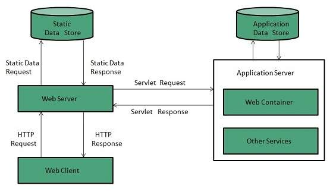

# Web server in C++

This is a group project that the three of us did
The essence of the project to recreate our own webserver, which performs all the basic functionality of http protocol
Our server runs in non-blocking multiplexed mode using unix functions of the operating system
The program works with its own configuration files, work with which also implemented by me and my colleagues, where the basis was taken by nginx syntax


## Technologies

1. C++
2. Make
3. HTML
4. CSS
5. HTTP

## Allow methods

1. GET
2. POST
3. DELETE

## Launch

1. Build a project using Makefile

   ```sh
   $ make
   ```

2. Run the program with one argument (configuration file), like this:

   ```sh
   $ ./webserv /storage/default.conf
   ```


## Vizualization

  
